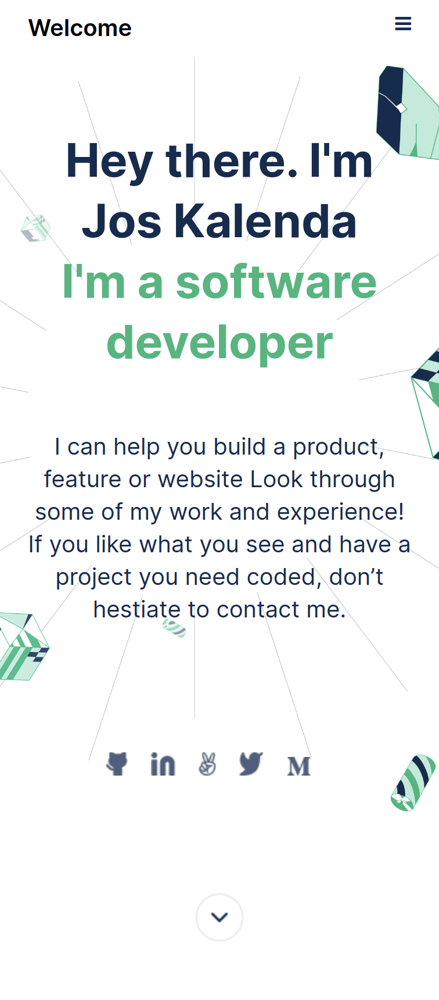
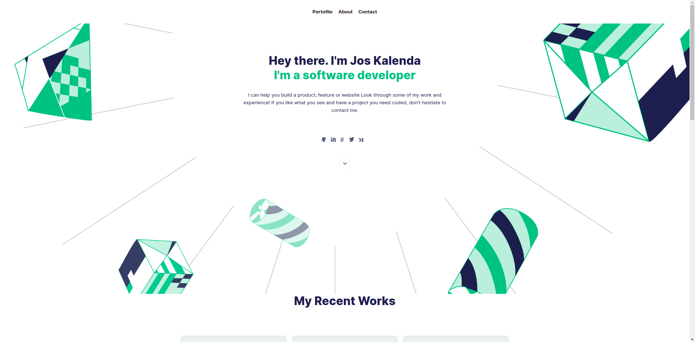

# portfolio

> Personal portfolio website
## Description 

| Mobile version representation.|
|---------------------------------------|
||

| Desktop version representation. |
|---------------------------------------|
||

> Project's principle obecjtives: 

- Use CSS Grid & Flexbox to place elements on the page.
- Understand how to parse a Figma design to create a UI.
- Create forms with HTML5 validations.
- Understand how to create UIs adaptable to different screen sizes using Media Queries.

Additional description about the project and its features.

## Built With

- html
- css

## Live Demo

[Live Demo Link](https://joskalenda.github.io/portfolio/)

## Authors

👤 **Author1**

- GitHub: [@Jos Kalenda](https://github.com/joskalenda)
- LinkedIn: [@Jos Kalenda](https://www.linkedin.com/in/jos-kalenda-908069205/)

## 🤝 Contributing

Contributions, issues, and feature requests are welcome!

Feel free to check the [issues page](https://github.com/joskalenda/portfolio/issues).

## Show your support

Give a ⭐️ if you like this project!

## Acknowledgments

- Hat tip to anyone whose code was used
- Inspiration
- etc

## 📝 License

This project is [MIT](./MIT.md) licensed.
